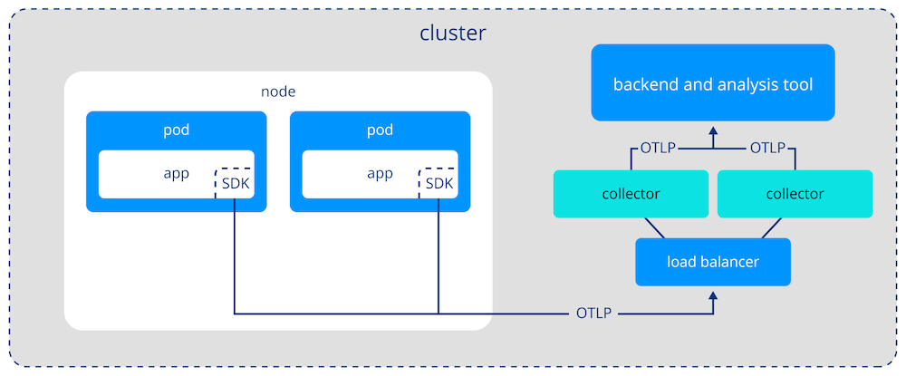

# 01. Getting Started with OpenTelemetry (LFS148)

Course Overview, Objectives, Timing, and Assessment
OpenTelemetry is a powerful framework that provides developers with the tools to monitor, trace, and log their applications with a unified observability solution. This course offers an in-depth introduction to OpenTelemetry, covering its core concepts, components, and practical applications. You will gain hands-on experience with setting up and configuring OpenTelemetry for your projects, learning how to instrument your applications to generate valuable telemetry data, and understanding how to export the collected data to observability backends.

In today's digital age, where microservices architectures and cloud-native solutions are prevalent, the ability to observe and understand the behavior of distributed systems is crucial. There are already many solutions to tackle this, but the solutions, protocols and data formats are not unified nor correlated. OpenTelemetry addresses the challenges of monitoring modern software environments by offering a unified API and set of tools that can be integrated into various languages, platforms and frameworks. By learning OpenTelemetry, you will be equipped with the skills to tackle the complexities of modern application landscapes, ensuring that your applications are resilient, performant, and ready to scale.

This course is designed to empower learners with the knowledge and skills needed to leverage OpenTelemetry effectively. You will not only learn the basics of OpenTelemetry, but also how to practically implement OpenTelemetry into existing applications. As a result, you will be able to automatically and manually instrument code with OpenTelemetry, set up the collection of data and then persist the collected data.

By the end of this course, you should be able to:

- Explain the basics of OpenTelemetry, its role in observability, and the current state of observability in the industry

- Explain how to instrument code and identify when to use manual and automatic instrumentation

- Manually instrument code to generate traces, metrics, and logs, which are essential components of observability

- Discuss the concept of automatic instrumentation and how to use OpenTelemetry's instrumentation libraries to simplify the process

- Discuss the OpenTelemetry Collector and Connector, which are responsible for processing and forwarding telemetry data

- Apply theoretical knowledge to practical scenarios, integrating OpenTelemetry into an application and understanding its capabilities

- Discuss the wider picture of the observability landscape

## Current State of Observability

According to Wikipedia, "observability is a measure of how well the internal states of a system can be inferred from knowledge of its external outputs" (2024). In other words, observability refers to how easily you can understand what's happening inside a system, like an application or a service, by looking at the information it produces.

A distributed system is a network of independent computers, or nodes, working together to perform tasks as if they were a single system. These systems are widely used in applications like cloud computing, where different parts of an application run on different servers to share resources and balance the workload. Because of the complexity of distributed systems, it can be challenging to understand what's happening inside each component at any given time. This is where observability becomes crucial.

To make a distributed system observable, we must model its state in a way that lets us reason about its behavior. This model is composed of three factors:

1. First, there is the workload. These are the operations a system performs to fulfill its objectives. For instance, when a user sends a request, a distributed system often breaks it down into smaller tasks handled by different services. This is also often referred to as transactions.

2. Second, there are software abstractions that make up the structure of the distributed system. This includes elements such as load balancers, services, pods, containers and more.

3. Lastly, there are physical machines that provide computational resources (e.g. RAM, CPU, disk space, network) to carry out work.


Depending on our background, we often have a certain bias when investigating the performance of or troubleshooting problems in a distributed system. Application developers typically concentrate on workload-related aspects, whereas operations teams tend to look at physical resources.

To truly understand a system, we must combine insights from multiple angles and figure out how they relate to one another. However, before we can analyze something, we must first capture aspects of system behavior. This is commonly being done through a combination of logs, metrics, and traces.

## Logs


A log is an append-only data structure that records events occurring in a system. A log entry consists of a timestamp that denotes when something happened and a message to describe details about the event. However, coming up with a standardized log format is no easy task. One reason is that different types of software often convey different pieces of information. The logs of an HTTP web server are bound to look different from those of the kernel. But even for similar software, people often have different opinions on what good logs should look like.

Apart from content, log formats also vary with their consumers. Initially, text-based formats catered to human readability. However, as software systems became more complex, the volume of logs soon became unmanageable. To combat this, we started encoding events as key/value pairs to make them machine-readable, which is commonly known as structured logging. Moreover, the distribution and ephemeral nature of containerized applications meant that it was no longer feasible to log onto individual machines and sift through logs. As a result, people started to build logging agents and protocols to forward logs to dedicated services. These logging systems allowed for efficient storage as well as the ability to search and filter logs in a central location.

## Metrics


Logs shine at providing detailed information about individual events. However, sometimes we need a high-level view of the current state of a system. This is where metrics come in. A metric is a single numerical value derived by applying a statistical measure to a group of events. In other words, metrics represent an aggregate. This is useful because their compact representation allows us to graph how a system changes over time. In response, the industry developed instruments to extract metrics, formats and protocols to represent and transmit data, specialized time-series databases to store them, and frontends to make this data accessible to end-users.

## Traces


As distributed systems grew in scale, it became clear that traditional logging systems often fell short when trying to debug complex problems. The reason is that we often have to understand the chain of events in a system. On a single machine, stack traces allow us to track an exception back to a line of code. In a distributed environment, we don’t have this luxury. Instead, we perform extensive filtering to locate log events of interest. To understand the larger context, we must identify other related events, such as the specific requests or transactions that initiated the log entry and the sequence of services or microservices involved in processing that request across the system. This often results in a lot of manual labor (e.g. comparing timestamps) or requires extensive domain knowledge about the applications. Recognizing this problem, Google developed Dapper, which popularized the concept of distributed tracing.

On a fundamental level, tracing is logging on steroids. The underlying idea is to add transactional context to logs. This makes it possible to infer causality and reconstruct the journey of requests in the system.

## Three Pillars of Observability

Telemetry is the process of automatically collecting and transmitting data from remote or distributed systems to monitor, measure, and track the performance or status of those systems. Telemetry data provides real-time insights into how different parts of an application are performing. Telemetry provides the data for observability tooling to help developers and system administrators observe, troubleshoot, and optimize the system without needing to manually check each component.

On the surface, logs, metrics, and traces share many similarities in their lifecycle and components. Everything starts with instrumentation that captures and emits data. The data has to have a specific structure defined by a format. Then, we need a mechanism to collect and forward a piece of telemetry. Often, there is some kind of agent to further enrich, process, and batch data before ingesting it in a backend. This process typically involves a database to efficiently store, index, and search large volumes of data. Finally, there is a frontend analysis to make the data accessible to the end-user. However, in practice, we develop dedicated systems for each type of telemetry, and for good reason: Each telemetry signal poses its own unique technical challenge. These challenges are mainly due to the different natures of the data.

The design of data models, interchange formats, and transmission protocols, highly depends on whether you are dealing with unstructured or semi-structured textual information, compact numerical values inside a time series, or graph-like structures depicting causality between events. Even for a single signal, there is no consensus on these topics.

Furthermore, how we work with and derive insights from telemetry varies dramatically. A system might need to perform full-text searches, inspect single events, analyze historical trends, visualize request flow, diagnose performance bottlenecks, and more. These requirements manifest themselves in the design and optimization of storage, access patterns, query capabilities, and more.

When addressing these technical challenges, vertical integration emerges as a pragmatic solution. In practice, observability vendors narrow the scope of the problem to a single signal and provide instrumentation to generate and tools to analyze telemetry, as a single, fully integrated solution.


Having dedicated systems for logs, metrics, and traces is why we commonly refer to them as the three pillars of observability. The notion of pillars provides a great mental framework because it emphasizes the following:

- There are different categories of telemetry
- Each pillar has its own unique strengths and stands on its own
- Pillars are complementary and must be combined to form a stable foundation for achieving observability

## Siloed Telemetry is Difficult to Work With


First, there are deficits in the quality of telemetry data. To illustrate this, let’s imagine that we want to investigate the root cause of a problem. The first indicator of a problem is usually an alert or an anomaly in a metrics dashboard. To confirm the incident is worth investigating, we have to form an initial hypothesis. The only information we currently have is that something happened at a particular point in time. Therefore, the first step is to use the metrics system to look for other metrics showing temporally correlated, abnormal behavior.


After making an educated guess about the problem, we want to drill down and investigate the root cause of the problem. To gain additional information, we typically switch to the logging system. Here, we write queries and perform extensive filtering to find log events related to suspicious metrics.

After discovering log events of interest, we often want to know about the larger context in which the operation took place. Unfortunately, traditional logging systems lack the mechanisms to reconstruct the chain of events in that particular transaction. Traditional logging systems often fail to capture the full context of an operation, making it difficult to correlate events across different services or components. They frequently lack the ability to preserve critical metadata, such as trace IDs or span IDs, which are essential for linking related events together. This limitation results in fragmented views of the system’s behavior, where the story of a single operation is spread across multiple logs without a clear narrative. Furthermore, the absence of standardized query languages or interfaces adds to the difficulty of searching and analyzing logs effectively, as operators must rely on custom scripts or manual filtering to uncover patterns and anomalies.

If we switch our perspectives from someone building an observability solution to someone using it, an inherent disconnect is revealed. The real world isn’t made up of logging, metrics, or tracing problems. Instead, we have to move back and forth between different types of telemetry to build up a mental model and reason about the behavior of a system. Since observability tools are silos of disconnected data, figuring out how pieces of information relate to one another causes a significant cognitive load for the operator.

## What is OpenTelemetry (in a nutshell)?
OpenTelemetry (OTel) is an open source project designed to provide standardized tools and APIs for generating, collecting, and exporting telemetry data such as traces, metrics, and logs. It aims to give developers deep visibility into applications, helping to monitor, troubleshoot, and optimize software systems.

The main goals of OpenTelemtry are:

- Unified telemetry: Combines tracing, logging, and metrics into a single framework enabling correlation of all data and establishing an open standard for telemetry data.

- Vendor-neutrality: Integration with different backends for processing the data.

- Cross-platform: Supports various languages (Java, Python, Go, etc.) and platforms, making it versatile for different development environments.

## What OpenTelemetry is NOT

Often it is helpful to define something by what it is not. 

OpenTelemetry is:

- Not an All-in-One Monitoring or Observability Tool
OpenTelemetry doesn't replace full-fledged monitoring or observability platforms like Datadog, New Relic, or Prometheus. Instead, it helps collect and standardize telemetry data (traces, metrics, logs) so that you can send it to these tools for visualization and analysis.

- Not a Data Storage or Dashboarding Solution
OpenTelemetry doesn’t store or visualize data. It focuses on the collection and export of telemetry data to external systems that handle storage and presentation, such as Grafana, Jaeger, or Prometheus.

- Not a Pre-configured Monitoring Tool
OpenTelemetry is a toolkit for collecting and exporting data, but it requires configuration and integration with other systems. It doesn’t automatically provide out-of-the-box monitoring or alerting functionality.

- Not a Performance Optimizer
While OpenTelemetry helps you collect detailed performance data, it doesn’t automatically optimize application performance. It's a diagnostic tool that helps you gather insights for manual tuning.

In essence, OpenTelemetry is an integration and standardization tool for telemetry data, not an all-in-one solution for monitoring, logging, or performance management. It complements other tools by standardizing the data collection process.

## Why is OpenTelemetry Promising?

At the time of writing (May 2024), OpenTelemetry is the second fastest-growing project within the CNCF. OpenTelemetry receives so much attention because it promises to be a fundamental shift in the way we produce telemetry. It’s important to remember that observability is a fairly young discipline. In the past, the rate of innovation and conflicts of interest prevented us from defining widely adopted standards for telemetry. However, the timing and momentum of OpenTelemetry appear to have a realistic chance of pushing for standardization of common aspects of telemetry.

Benefits of OpenTelemtry

#### Instrument once, use everywhere
A key promise of OpenTelemetry is that you instrument code once and never again, giving you the ability to use that instrumentation everywhere. OpenTelemetry recognizes that, should its efforts be successful, it will be a core dependency for many software projects. Therefore, it follows strict processes to provide long-term stability guarantees. Once a signal is declared stable, the promise is that clients will never experience a breaking API change.

#### Separate telemetry generation from analysis
Another core idea of OpenTelemetry is to separate the mechanisms that produce telemetry from the systems that analyze it. Open and vendor-agnostic instrumentation marks a fundamental change in the observability business. Instead of pouring resources into building proprietary instrumentation and keeping it up to date, vendors must differentiate themselves through feature-rich analysis platforms with great usability. OpenTelemetry fosters competition, because users are no longer stuck with the observability solution they chose during development. After switching to OpenTelemetry, you can move platforms without having to re-instrument your entire system.

#### Make software observable by default
With OpenTelemetry, open source developers are able to add native instrumentation to their projects without introducing vendor-specific code that burdens their users. The idea is to make observability a first-class citizen during development. By having software ship with built-in instrumentation, we no longer need elaborate mechanisms to capture and integrate it after the fact.

#### Improve how we use telemetry
Last (and definitely not least), OpenTelemetry tries to change how we think about and use telemetry. Instead of having three separate silos for logs, metrics, and traces, OpenTelemetry follows a paradigm of linking telemetry signals together. With context creating touch points between signals, the overall value and usability of telemetry increase drastically. For instance, imagine the ability to jump from conspicuous statistics in a dashboard straight to the related logs. Correlated telemetry data helps to reduce the cognitive load on humans operating complex systems. Being able to take advantage of linked data will mark a new generation of observability tools.

# 03. Overview of the OpenTelemetry Framework

Only time will tell if OpenTelemetry can live up to its ambitious goals. Chances are, you’re eager to explore the project and try it out yourself to see what the fuss is about. However, newcomers often feel overwhelmed when getting into OpenTelemetry. The reason is clear: OpenTelemetry is a vast endeavor that addresses a multitude of problems by creating a comprehensive observability framework. Before you dive into the labs, we want to give you a high-level overview of the structure and scope of the project.

## Signal Specification (Language-Agnostic)

On a high level, OpenTelemetry is organized into signals, which mainly include tracing, metrics and logging. Every signal is developed as a standalone component (but there are ways to connect data streams to one another). Signals are defined inside OpenTelemetry’s language-agnostic [specification](https://opentelemetry.io/docs/specs/), which lies at the very heart of the project. The end-user probably won’t come into direct contact with the specification, but it plays a vital role in ensuring consistency and interoperability within the OpenTelemetry ecosystem.


The specification consists of three parts. First, there are [definitions of terms](https://opentelemetry.io/docs/specs/otel/glossary/) that establish a common vocabulary and shared understanding to avoid confusion. Second, it specifies the technical details of how each signal is designed. This includes:

- an API specification (see [Tracing API](https://opentelemetry.io/docs/specs/otel/trace/api/), [Metrics API](https://opentelemetry.io/docs/specs/otel/trace/api/), and [OpenTelemetry Logging](https://opentelemetry.io/docs/specs/otel/logs/))
defines (conceptual) interfaces that implementations must adhere to
ensures that implementations are compatible with each other
includes the methods that can be used to generate, process, and export telemetry data

- an SDK specification (see [Tracing SDK](https://opentelemetry.io/docs/specs/otel/trace/sdk/), [Metrics SDK](https://opentelemetry.io/docs/specs/otel/metrics/sdk/), [Logs SDK](https://opentelemetry.io/docs/specs/otel/logs/sdk/))
serves as a guide for developers
defines requirements that a language-specific implementation of the API must meet to be compliant
includes concepts around the configuration, processing, and exporting of telemetry data

Besides signal architecture, the specification also covers aspects related to telemetry data. For example, OpenTelemetry defines [semantic conventions](https://opentelemetry.io/docs/specs/semconv/). By pushing for consistency in the naming and interpretation of common telemetry metadata, OpenTelemetry aims to reduce the need to normalize data coming from different sources. Finally, there is also the [OpenTelemetry Protocol (OTLP)](https://opentelemetry.io/docs/specs/otlp/), which we’ll cover later in the chapter.

## Vendor-Agnostic, Language-Specific Instrumentation


To generate and emit telemetry from applications, we use language-specific implementations, which adhere to OpenTelemetry’s specification. OpenTelemetry supports a wide-range of popular programming languages at varying levels of maturity. The implementation of a signal consists of two parts:

- API
    - defines the interfaces and constants outlined in the specification
    - used by application and library developers for vendor-agnostic instrumentation
    - refers to a no-op implementation by default
- SDK
    - provider implements the OpenTelemetry API
    - contains the actual logic to generate, process and emit telemetry
    - OpenTelemetry ships with official providers that serve as the reference implementation (commonly referred to as the SDK)
    - it is possible to write your own

Generally speaking, we use the OpenTelemetry API to add instrumentation to our source code. In practice, this can be achieved in various ways, such as:

- zero-code or automatic instrumentation (if available and to avoid code changes)
- instrumentation libraries that provide simplified OpenTelemetry integration (which may or may not require code changes)
- manual or code-based instrumentation (for fine-grained control, deeply embedded in the code)

For now, let’s skip further details and focus on why OpenTelemetry decided to separate the API from the SDK. On startup, the application registers a provider for every type of signal. After that, calls to the API are forwarded to the respective provider. If we don’t explicitly register one, OpenTelemetry will use a fallback provider that translates API calls into no-ops.

The primary reason for separating the API from the SDK is that it makes it easier to embed native instrumentation into open source library code. OpenTelemetry’s API is designed to be lightweight and safe to depend on. The signal’s implementation provided by the SDK is significantly more complex and likely contains dependencies on other software. Forcing these dependencies on users could lead to conflicts with their particular software stack. Registering a provider during the initial setup allows users to resolve dependency conflicts by choosing a different implementation. Furthermore, it allows us to ship software with built-in observability without forcing the runtime cost of instrumentation onto users that don’t need it.

## Telemetry Processor (Standalone Component)


So far, we have seen that OpenTelemetry provides tooling for vendor-agnostic instrumentation to application and library developers. This alone marks a significant milestone, but OpenTelemetry’s framework goes much further. After generating and emitting telemetry, operators are responsible for managing and ingesting it into the respective backends. This includes tasks such as:

- gathering data from various sources
- parsing and converting it for downstream processing
- enrichment with additional metadata
- filtering out irrelevant data to reduce noise and storage requirements
- normalization and applying transformations
- buffering for resilience and performance
- routing to steer subsets of telemetry to different destinations
- forwarding to backends

To build and configure such telemetry pipelines, operations teams often deploy additional infrastructure. A popular example is the fluentbit telemetry agents. Similarly, OpenTelemetry provides a standalone component with these capabilities: the OpenTelemetry Collector.

## Wire Protocol

Completing the standardization, generation, and management package, OpenTelemetry also defines how to transport telemetry between producers, agents, and backends.

The O[penTelemetry Protocol (OTLP)](https://opentelemetry.io/docs/specs/otel/protocol/) is an open source and vendor-neutral wire format that defines:

- how data is encoded in memory
- a protocol to transport that data across the network

As a result, OTLP is used throughout the observability stack. Emitting telemetry in OLTP means that instrumented applications and third-party services are compatible with countless observability solutions. The Collector supports receiving telemetry from and exporting to a various formats (e.g., Prometheus Metrics, Zipkin traces, etc.). However, OTLP is generally preferred because the Collector uses it internally to represent and process telemetry. Thereby, we avoid the cost of converting between formats and increase consistency. This is because the native format closely aligns with the ideas proposed by the framework (having attributes follow semantic conventions, cross-signal correlation, etc.).

Similarly, most observability backends support OTLP right out of the box. Given the rapid adoption of OpenTelemetry, integrating with OTLP automatically gives you access to a broad audience of potential users. Moreover, an open and vendor-neutral telemetry protocol means less work for developers of observability tools. Before, you had to develop countless adapters to be able to ingest data arriving in various proprietary formats. In other words, OTLP is a significant push for interoperability between tools and services in the observability ecosystem.

OTLP offers three transport mechanisms for transmitting telemetry data: HTTP/1.1, HTTP/2, and gRPC. When using OTLP, the choice of transport mechanism depends on application requirements, considering factors such as performance, reliability, and security. OTLP data is often encoded using the Protocol Buffers (Protobuf) binary format, which is compact and efficient for network transmission and supports schema evolution, allowing for future changes to the data model without breaking compatibility. Data can also be encoded in the JSON file format, which allows for a human-readable format with the disadvantage of higher network traffic and larger file sizes.

# Instrumentation

This chapter focuses on one of the fundamental things in observability - instrumentation. We touched on this term briefly in the chapter “Overview of the OpenTelemetry”. In this chapter we will explain what the term “instrumentation” means exactly and what options and approaches are possible with OpenTelemetry.

## Recap: What is instrumentation?

Instrumentation refers to the process of adding code or using tools to collect telemetry data (such as logs, metrics, and traces) from an application.

In other words it means you add something to your application code, which turns a non-observed application into an application that emits data from within the application. Instrumented applications are like the difference between a foreign language film and one with subtitles; The instrumentation explains what's happening.

This data provides insights into how the application behaves at runtime, helping developers monitor performance, diagnose issues, and understand overall system health.

In the context of observability, instrumentation is a critical first step. It enables the collection of telemetry signals that allow observability tools to track and visualize how an application and its components are performing. By instrumenting applications, developers can identify bottlenecks, trace requests across distributed services, and monitor resource usage—all essential for understanding system behavior in real-time.

However, instrumentation is often highly dependent on the programming language and framework in use. This means that instrumentation code tends to be proprietary, tailored to the specific tools, libraries, and architecture of each application. As a result, developers must often implement custom instrumentation for each language or framework they work with, which can lead to challenges in maintaining consistency across different parts of a system, especially in polyglot (multi-language) environments.

It also means that the more specific the information you want to extract from your application, the more specific your instrumentation effort has to be.

The instrumentation also defines which kind of telemetry signals are being handled.

## Different Instrumentation Types

The chapter “Overview of the OpenTelemetry Framework” introduced three different instrumentation categories for OTel: automatic, libraries, and manual. If you look into the documentation you will also find the terminology of zero-code and code-based instrumentation, which can be somewhat confusing.

In this section, we will explain each of these categories

Categories for OpenTelemetry

### Automatic Instrumentation (or zero-code)

- No code changes required: Automatically instruments applications without modifying the source code.

- Typically provided by OpenTelemetry agents or plugins: These agents attach to the runtime of the application and automatically collect telemetry data.

- Ideal for quick setup: It works out of the box and is used to gather traces, metrics, and logs without manual intervention.

- Less granular control: While easy to use, automatic instrumentation may not offer as much fine-tuning or customization as manual instrumentation.

Examples:

OpenTelemetry agents for Java or Python, which can automatically instrument common libraries like HTTP, databases, or messaging systems.

This type of instrumentation will be covered in a future lab.

### Instrumentation Libraries (potentially code-based)

- May require minimal code changes: Libraries are often specific to a programming language or framework and are integrated by importing them into the code. Some libraries provide easy integration with minimal configuration, while others might need manual intervention.

- Provides more flexibility: They allow you to add instrumentation where automatic methods may not reach or to extend it with custom logic.

- Control over integration: You can use libraries to instrument specific parts of an application in more detail.

Examples:

OpenTelemetry instrumentation libraries for specific frameworks like Django (Python) or Spring (Java), where you might need to configure middleware or wrap methods to enable tracing or metrics.

This type of instrumentation will also be covered in a hands-on lab.

### Manual Instrumentation (fully code-based)

- Requires explicit code changes: Manual instrumentation involves directly adding OpenTelemetry API calls in the source code.

- Fine-grained control: It gives developers full control over what gets instrumented, how it is measured, and what data is collected. You can choose exactly where to start and end traces, log specific events, or capture custom metrics.

- Customization: It is the most flexible approach, allowing developers to instrument any part of the application, regardless of whether automatic or library-based options are available.

- More effort and maintenance: Manual instrumentation takes more time to implement and maintain, as developers need to explicitly manage spans, metrics, and logging points in the code

Examples:

Using OpenTelemetry's API to define custom spans, attributes, or events, such as manually wrapping a specific block of code in a custom trace.
Adding custom metrics that are not automatically captured, such as counting how many times a particular business function is called.
This type of instrumentation will be covered in a future lab.

### Distinctions Across Instrumentation Methods

| Type     | Effort | Control | Customization | Code Changes |
| -------- | ------ | ------- | ------------- | ------------ |
| Automatic Instrumentation | Low | Limited | Minimal | None |
| Instrumentation Libraries | Moderate | Medium (some configurations) | Moderate (framewrok-level) | Minimal to Moderate |
| Manual Instrumentation | High | Full | Full | Exntesive | 

### Overlap

Some instrumentation libraries might provide automatic instrumentation when configured, blurring the lines. For example, a library might automatically instrument HTTP requests once imported, or you might have to manually add a few lines of code for full functionality.

In short, the line isn't always distinct, but automatic instrumentation is generally code-free and broad, while instrumentation libraries offer more granular control and flexibility, sometimes with minimal code changes.

Also, technically speaking, every implementation approach will use some form of libraries. In an automatic or zero-code approach, libraries are simply added and perform predefined actions. In a manual or code-based approach, you will add libraries that enable API/SDK calls directly from within your code.

### Instrumentation Libraries

The long-term vision of OpenTelemetry is for third-party libraries or frameworks to ship with native OpenTelemetry instrumentation, providing out-of-the-box observability. However, not all projects have native support for the evolving OpenTelemetry APIs. To address this gap, instrumentation libraries have been developed. These libraries help increase OpenTelemetry adoption without relying entirely on library maintainers.

An instrumentation library is a standalone, separately installed library designed to inject OpenTelemetry API calls into a library or framework lacking native integration. The approach varies depending on the programming language and the specific library, including techniques such as wrapping interfaces, monkey-patching code, and registering callbacks on library-specific hooks.

OpenTelemetry maintains a registry of these libraries, which includes many options for different frameworks and programming languages. However, many libraries are still in alpha or beta stages. To find a suitable library, you can search the registry for your framework or language.

## Benefits and Challenges: Libraries

Instrumentation libraries offer a valuable way to enhance observability in third-party libraries or frameworks lacking native OpenTelemetry support. They simplify the adoption process but come with challenges:

- Dependency Management: Adds complexity and requires careful maintenance.
- Community Support: Libraries may have limited support and resources compared to native integrations.

Instrumentation libraries are especially useful when native instrumentation is unavailable and manual instrumentation is impractical. They are often used in conjunction with OpenTelemetry’s auto-instrumentation, which dynamically injects observability into applications without code changes.

## Benefits and Challenges: Auto-Instrumentation

Auto-instrumentation simplifies the observability setup by using agents or runners that dynamically inject instrumentation into the application at runtime. This is achieved through mechanisms specific to each programming language.

For example: 

Bytecode Manipulation via Java Agent In Java

Auto-instrumentation often involves bytecode manipulation through Java agents. Java provides entry points like

premain and  agentmain to modify bytecode before it is loaded into the JVM. Using tools like Byte Buddy, developers can create Java agents that inject instrumentation logic into class files dynamically. Here’s a simplified example of how a Java agent might work:

``` java
public class MyAgent {
    public static void premain(String agentArgs, Instrumentation inst) {
        inst.addTransformer(new MyTransformer());
    }
}

public class MyTransformer implements ClassFileTransformer {
    @Override
    public byte[] transform(
            ClassLoader loader,
            String className,
            Class<?> classBeingRedefined,
            ProtectionDomain protectionDomain,
            byte[] classfileBuffer
    ) {
        // Perform bytecode transformation
        // ...

        // Return the modified bytecode

        return modifiedBytecode;
```

Auto-instrumentation agents from various vendors work similarly, detecting and instrumenting relevant classes and methods at runtime. The OpenTelemetry Java Agent simplifies this process with its opentelemetry-javaagent.jar, which includes libraries for various frameworks and automates bytecode adaptation. 

While auto-instrumentation is a powerful feature, it’s worth noting that not all languages support similar mechanisms. Thus, auto-instrumentation capabilities may vary across different programming languages.

### Benefits and Challenges: Manual Instrumentation

Manual instrumentation using the OpenTelemetry API and SDK can be labor-intensive. The process involves significant code modifications and learning the telemetry framework, which can be overwhelming, especially in legacy codebases. Despite OpenTelemetry’s goal of "instrument once and never again," the cost and complexity of manual instrumentation may still be high.

Recognizing these challenges, OpenTelemetry supports incremental migration strategies to simplify adoption. Instrumentation libraries and auto-instrumentation aim to provide predefined metrics, traces, and logs with minimal code changes, easing the integration process.

## Manual Instrumentation - Traces


_Overview of OpenTelemetry’s Tracing Signal_


_Tracing Signal_

With the help of a tracer, let’s generate our first piece of telemetry. On a high level, we must add instrumentation to our code that creates and finishes spans. OpenTelemetry’s Python implementation provides multiple ways to do this. Some aim to be simple and non-intrusive, while others are explicit but offer greater control.


_Enriching Spans with Resources and Attributes_

So far, the contents of the span were automatically generated by the SDK. This information is enough to reason about the chain of events in a transaction and allows us to measure latency. However, it’s important to understand that tracing is a much more potent tool. To extract meaningful insights into what is happening in a system, our traces need additional context.

## Manual Instrumentation - Metrics


_Metrics Signal_

Before diving head first into the lab exercises, let’s start with a brief overview of OpenTelemetry’s metrics signal. As usual, OpenTelemetry separates the API and the SDK. The metrics API provides the interfaces that we use to instrument our application. OpenTelemetry’s SDK ships with an official MeterProvider that implements the logic of the metrics signal. To generate metrics, we first obtain a Meter which is used to create different types of instruments that report measurements. After producing data, we must define a strategy for how metrics are sent downstream. A MetricReader collects the measurements of associated instruments. The paired MetricExporter is responsible for getting the data to the destination.


_Overview of Different Instruments_

Similar to the real world, there are different types of instruments available, depending on what you try to measure. OpenTelemetry provides different types of instruments to measure various aspects of your application. Let's look at some examples below.

Instruments

#### Counters
Counters are used for monotonically increasing values, such as the total number of requests handled by a server.

#### UpAndDownCounters
UpAndDownCounters are used to track values that can both increase and decrease, like the number of active connections to a database.

#### Gauge
Gauge instruments reflect the state of a value at a given time, such as the current memory usage of a process. Learn more about Gauge instruments in the OpenTelemetry Documentation.

#### Histogram
Histogram instruments are used to analyze the distribution of how frequently a value occurs, which can help identify trends or anomalies in the data.

Each type of instrument, except for histograms, has a synchronous and asynchronous variant. Synchronous instruments are invoked in line with the application code, while asynchronous instruments register a callback function that is invoked on demand. This allows for more efficient and flexible metric collection, especially in scenarios where the metric value is expensive to compute or when the metric value changes infrequently.

For now, we will focus on the basic concepts and keep things simple, but as you become more familiar with OpenTelemetry, you will be able to leverage these components to create more sophisticated metric collection and analysis strategies.

## Create Instruments to Record Measurements

The scope_metrics array contains metrics scopes, each representing a logical unit of the application code with which the telemetry is associated. Each scope includes a scope section that identifies the instrumentation scope, such as the name and version of the instrumented module or library, and an optional schema URL.

The metrics array within each scope contains the actual metrics reported by instruments associated with the meter, with each metric having a name, description, unit, and data points. The data points include attributes, timestamps, and the value of the measurement, along with properties that describe the aggregation temporality and whether the metric is monotonic.

The PeriodicExportingMetricReader records the state of metrics from the SDK at a regular interval and the ConsoleMetricExporter writes a JSON representation to stdout. Similar to tracing, we can attach a resource to the telemetry generated by the MeterProvider. The JSON snippet provided is an example of the OpenTelemetry metrics data model, which is a structured representation of telemetry data collected from an application. The resource section describes the entity being monitored, such as a service or a host, and includes attributes like the language of the telemetry SDK, the SDK’s name and version, and the service’s name.


The scope_metrics section has two main parts: scope and metrics. First, the instrumentation scope identifies a logical unit in the application code with which the telemetry is associated. It represents the name and version parameters we passed to get_meter.


The metrics field contains a list of metrics reported by instruments associated with the meter. Each metric consists of two main parts. First, there is information to identify the instrument (e.g. name, kind, unit, and description). Second, the data contains a list of data_points, which are measurements recorded by the instrument.

Each measurement typically consists of a value, attributes, and a timestamp. The aggregation_temporality indicates whether the metric is cumulative, and is_monotonic specifies whether the metric only increases (or decreases, in the case of a gauge). This model is designed to be flexible and extensible, ensuring compatibility with existing monitoring systems and standards like Prometheus and StatsD, facilitating interoperability with various monitoring tools.

## The Four Golden Signals of Observability

Now, let’s use our understanding of the metrics signal. Before we do that, we must address an important question: What do we measure? Unfortunately, the answer is anything but simple. Due to the vast number of events within a system and many statistical measures to calculate, there are nearly infinite things to measure. A catch-all approach is cost-prohibitive from a computation and storage point, increases the noise which makes it harder to find important signals, leads to alert fatigue, and so on.

The term metric refers to a statistic that we consciously chose to collect because we deem it to be important. Important is a deliberately vague term, because it means different things to different people. A system administrator typically approaches an investigation by looking at the utilization or saturation of physical system resources. A developer is usually more interested in how the application responds, looking at the applied workload, response times, error rates, etc. In contrast, a customer-centric role might look at more high-level indicators related to contractual obligations (e.g. as defined by an SLA), business outcomes, and so on. The details of different monitoring perspectives and methodologies (such as [USE](https://www.brendangregg.com/usemethod.html) and RED) are beyond the scope of this lab.

However, [the four golden signals](https://sre.google/sre-book/monitoring-distributed-systems/#xref_monitoring_golden-signals) of observability often provide a good starting point:

- Traffic: volume of requests handled by the system
- Errors: rate of failed requests
- Latency: the amount of time it takes to serve a request
- Saturation: how much of a resource is being consumed at a given time

Let’s instrument our application accordingly.

### Latency

The time it takes a service to process a request is a crucial indicator of potential problems. The tracing lab showed that spans contain timestamps that measure the duration of an operation. Traces allow us to analyze latency in a specific transaction. However, in practice, we often want to monitor the overall latency for a given service. While it is possible to compute this from span metadata, converting between telemetry signals is not very practical. For example, since capturing traces for every request is resource-intensive, we might want to use sampling to reduce overhead. Depending on the strategy, sampling may increase the probability that outlier events are missed.

Therefore, we typically analyze the latency via a Histogram. Histograms are ideal for this because they represent a frequency distribution across many requests. They allow us to divide a set of data points into percentage-based segments, commonly known as percentiles. For example, the 95th percentile latency (P95) represents the value below which 95% of response times fall. A significant gap between P50 and higher percentiles suggests that a small percentage of requests experience longer delays. A major challenge is that there is no unified definition of how to measure latency. We could measure the time a service spends processing application code, the time it takes to get a response from a remote service, and so on. To interpret measurements correctly, it is vital to have information on what was measured.

Let’s use the meter to create a Histogram instrument. Refer to the semantic conventions for [HTTP Metrics](https://opentelemetry.io/docs/specs/semconv/http/http-metrics/) for an instrument name and preferred unit of measurement. To measure the time it took to serve the request, we’ll use our before_request_func and after_request_func functions. In before_request_func, we will create a timestamp for the start of the request and add it to the request context. In after_request_func, we will take a timestamp for the end of the request and subtract them to calculate the duration. We often need additional context to draw the right conclusions. For example, a service’s latency number might indicate fast replies. However, in reality, the service might be fast because it serves errors instead of replies. Let’s get started.

### Saturation
All the previous metrics have been request-oriented. For completeness, we’ll also capture some resource-oriented metrics. According to Google’s SRE book, the fourth golden signal is called [“saturation”](https://sre.google/sre-book/monitoring-distributed-systems/#saturation). Unfortunately, the terminology is not well-defined. Brendan Gregg, a renowned expert in the field, defines saturation as the “amount of work that a resource is unable to service.” In other words, saturation is a backlog of unprocessed work. An example of a saturation metric would be the length of a queue.

In contrast, utilization refers to the average time that a resource was busy servicing work. We usually measure utilization as a percentage over time. For example, 100% utilization means no more work can be accepted. If we go strictly by definition, both terms refer to separate concepts. One can lead to the other, but it doesn’t have to. It is possible for a resource to experience high utilization without any saturation. However, Google’s definition of saturation resembles that of utilization, which can be confusing. Let’s put the matter of terminology aside.

​Let’s measure some resource utilization metrics. To keep things simple, we have already installed the psutil library for you. Let’s create a function called create_resource_instruments to obtain instruments related to resources. Then we will use the meter to create an ObservableGauge to track the current CPU utilization and an ObservableUpDownCounter to record the memory usage. Since both are asynchronous instruments, we’ll also define two callback functions that are called on demand and return an Observation.

### View

So far, we have seen how to generate some metrics. Views let us customize how metrics are collected and output by the SDK.

Before we begin, let’s create a new function called create_views. To register views, we will pass them to the MeterProvider. The definition of a View consists of two parts. First, we must match the instrument(s) that we want to modify. The View constructor provides many criteria to specify a selection.

Every instrument type has a default method for aggregating a metric based on incoming measurements. For instance, a Counter performs a SumAggregation, while a Gauge defaults to LastValueAggregation. Previously, semantic conventions recommended measuring request latency in seconds. However, this meant that measurements didn’t align with the default bucket boundaries defined by the Histogram. The View’s aggregation argument lets us customize how instruments aggregate metrics.

However, Views are much more powerful than changing an instrument’s aggregation. For example, we can use attribute_keys to specify an accept list of attributes to report. An operator might want to drop metric dimensions because they are deemed unimportant, to reduce memory usage and storage, prevent leaking sensitive information, and so on. If we pass an empty set, the SDK should no longer report separate counters for the URL paths.

Moreover, a View’s name parameter can be used to rename a matched instrument. This could be used to ensure that generated metrics align with OpenTelemetry’s semantic conventions. Moreover, Views allow us to filter what instruments should be processed. If we pass DropAggregation, the SDK will ignore all measurements from the matched instruments. You have now seen some basic examples of how Views let us match instruments and customize the metrics stream.

## Manual Instrumentation - Logs

Logs are one of the main pillars of observability and part of the MELT acronym (Logs, Metrics, Traces, and Events). Therefore, they are critical to determining a system's behavior and health. Logs have the longest legacy among all the signals. For decades, simple instructions were used to print debug output to files (or stdout) such as System.out.println("Hello, World!") in Java, print('Hello, World!') in Python, or the println!("Hello, World!") Macro in Rust. Thereby, logs can represent any data you want. It could be structured data like JSON:

```json
{
  "app": "example-app",
  "level": "debug",
  "message": "started example-app in 453ms",
  "timestamp": 1706876665982232832
}
```
Or it could be unstructured data, like a string, that signals which function call your program just entered.

``` entered function example_function ```

With the increased complexity of computer programs, especially with the introduction of distributed systems, just printing any data to a file or stdout was no longer sufficient. Also, printing every debug statement to a file could accumulate large amounts of data, which could decrease available disk space and, in the worst case, use up all the available disk space, leading to system crashes. Frameworks, like Log4j, emerged that assisted the developer in creating more structured logs, including logging levels (Trace, Debug, Info, Warn, Error, Fatal), that could roughly filter log data or automatically add data to enrich the log entries with essential data, like timestamps or the name of the class that created an entry. For example, a log entry like this can be found in Spring Boot applications running in Docker:

```
example-app | 2024-02-02 12:06:49.335 INFO 1 --- [main] w.s.c.ServletWebServerApplicationContext : Root WebApplicationContext: initialization completed in 837 ms
```

This log entry adds metadata like the service name (Docker), a timestamp when the log entry was generated (Spring), a log level - in this case, INFO, a context where the log was generated, and the log message.

With the rise of distributed systems and microservices, collecting the log entries on the machine running the services has become impractical. So, the need emerged for log aggregation tools like fluentd, the ELK stack (Elasticsearch, Logstash, Kibana), or Grafana Loki. These tools can aggregate log entries from multiple sources to store these entries in a centralized solution. In the example above, multiple containers are deployed that run a log collector agent that sends log entries to a Grafana Loki instance. Loki stores the entries, indexes them, and makes them queryable via LogQL. With LogQL logs, entries can then be explored with Grafana, where dashboards or alerts can be configured for the entries.


_Log Entries Collected from Different Sources with Different Agents Made Queryable Using Grafana Loki_

This capability enabled developers to perform indexing and searching to find failures and problems faster, run log analysis to find patterns or trends, monitor log entries to find anomalies, trigger alerts, or generate reports. This was a giant leap forward with using log entries in observability, but it still wasn't perfect. If you tried to get more context, like the call stack or other services, developers still needed to find the corresponding traces and spans by correlating the timestamps or IDs. Besides, there are multiple formats for logs and multiple aggregators to collect the entries. Nothing is unified, and not every aggregator can read every logging format. This would lead to fragmentation and additional effort to integrate logging into the observability stack of an application.

This is where the idea of OpenTelemetry Logging was born.


_Telemetry Collection Before OpenTelemetry_

## OpenTelemetry Logging

In OpenTelemetry, every piece of data that is neither a part of a distributed trace nor a metric is considered a log. For example, events are just specialized log entries.

Logging in OpenTelemetry differs a little from the other signals. Logging is not implemented from the ground up, like traces and metrics, which are exposed in newly built APIs and implemented in SDKs. It uses existing logging functionality from programming languages or existing logging libraries to integrate into. However, this is not necessarily a permanent approach - user-facing logging APIs might be developed in the OpenTelemetry specification, though the bridge method with existing logging systems will continue to be supported. To accomplish that, OpenTelemetry exposes a Logs Bridge API that combines the existing logging solution with traces and metrics collected by OpenTelemetry or other components of OpenTelemetry. Application developers should not use this API, as it should be provided by the logging solution. The logging solution should be configured to send log entries, also called LogRecord, into a LogRecordExporter. The logging solution can use the LoggerProvider factory to create new Logger instances that are initialized once and match the application's lifecycle. The created logger is responsible for creating log entries. When logs are created, LogRecordExporters is responsible for sending the log entries to a collector like the OpenTelemetry Collector. The log entry, which is of type LogRecord, consists of multiple fields like timestamp, traceId, spanId, severityText, body, and others that will be discussed in the exercise for this chapter.

The data model of OpenTelemetry logging is designed so that existing data models can be mapped to the OpenTelemetry data model. Translating logging data from an arbitrary logging format into the data model and then translating it into another logging format should not be worse than translating the initial logging format directly to the other format. The data model is designed to encompass various types of logs, including system formats generated by the operating system (e.g., syslog), logs from third-party applications (e.g., Apache log files), and logs from first-party applications where developers can customize the logging format.

OpenTelemetry defines which fields map to which type in the specs, and mappings are already defined for some logging formats and libraries. The OpenTelemetry stack creates a unified way to collect telemetry data. Since logs provide additional metadata, all the collected telemetry data can be correlated to each other. This will be further demonstrated in the following exercise.


_Collecting Telemetry Data with OpenTelemetry

## Additional Resources

- [OpenTelemetry logs](https://opentelemetry.io/docs/concepts/signals/logs/)
- [OpenTelemetry Logging](https://opentelemetry.io/docs/specs/otel/logs/)
- [Logs Data Model | OpenTelemetry](https://opentelemetry.io/docs/specs/otel/logs/data-model/)
- [Getting Started | OpenTelemetry](https://opentelemetry.io/docs/languages/python/getting-started/)
- [OpenTelemetry Python API and SDK](https://github.com/open-telemetry/opentelemetry-python)
- [OpenTelemetry Logging Instrumentation](https://github.com/open-telemetry/opentelemetry-python)

# Open Telemetry Collector

The OpenTelemetry Collector is a critical infrastructure component that decouples telemetry generation from its processing and export, allowing for flexible configuration outside the application code. Centralizing telemetry management, streamlines monitoring and observability across diverse systems, improving scalability, maintainability, and operational efficiency. We will discuss the usage of the OpenTelemetry Collector, the architecture of telemetry pipelines, and different ways to deploy a collector.

## Retrospective

During the previous labs, we saw how OpenTelemetry’s SDK implements the instrumentation that produces the telemetry data. We also configured a basic pipeline to export the generated telemetry directly from the SDK. The Collector is a key component of OpenTelemetry that manages how telemetry is processed and forwarded.

Now, you might ask yourself: How are these capabilities different from the SDK?

With the SDK, the telemetry pipeline was defined in the application code. Depending on your use case, this approach can be perfectly fine. A Collector, on the other hand, is a binary written in Go, that runs as a separate, standalone process. It provides a flexible, configurable, and vendor-agnostic system to process telemetry outside the application. It is essentially a broker between a telemetry source and the backend storing the data.

## The Benefits of Collectors

Deploying a Collector has many advantages. Most importantly, it allows for a cleaner separation of concerns. Developers shouldn’t have to care about what happens to telemetry after it has been generated. With a Collector, operators can control the telemetry configuration without modifying the application code. Additionally, consolidating these concerns in a central location streamlines maintenance. In an SDK-based approach, the configuration of where telemetry is going, what format it needs to be in, and how it should be processed is spread across various codebases managed by separate teams. However, telemetry pipelines are rarely specific to individual applications. Without a Collector, adjusting the configuration and keeping it consistent across applications can get tricky.

Moving things out of the SDK has other benefits. For instance, the overall configuration of the SDK becomes much leaner. Moreover, we no longer have to redeploy the application every time we make a change to the telemetry pipeline. Troubleshooting becomes significantly easier since there is only one location to monitor when debugging problems related to telemetry processing. Offloading processing and forwarding to another process means applications can spend their resources on performing actual work rather than dealing with telemetry. Before going into more detail, let’s look at the components that make up a collector.

## Receivers


_Collector to Process and Forward Telemetry_

The pipeline for a telemetry signal consists of a combination of receivers, processors, and exporters.

A receiver is how data gets from a source (i.e. the application) to the OpenTelemetry collector. This mechanism can either be pull- or push-based. Out-of-the-box, the Collector supports an OTLPReceiver for receiving traces, metrics, and logs in OpenTelemetry’s native format. The collector-contrib repository includes a range of receivers to ingest telemetry data encoded in various protocols. For example, there is a ZipkinReceiver for traces, StatsdReceiver and PrometheusReceiver and much more. Once data has been imported, receivers convert telemetry into an internal representation. Then, receivers pass the collected telemetry to a chain of processors.

## Processors

A processor provides a mechanism to pre-process telemetry before sending it to a backend. There are two categories of processors, some apply to all signals, while others are specific to a particular type of telemetry. Broadly speaking, processing telemetry is generally motivated by several reasons:

- To improve the data quality
    - add, delete, rename, transform attributes
    - create new telemetry based on existing data
    - convert an older version of a data source into one that matches the current dashboards and queries used by the backend
- For governance and compliance reasons
    - use attributes to route data to specific backends
- To reduce cost
    - drop unwanted telemetry via allow and deny lists
    - tail-based sampling
- Security
    - scrubbing data to prevent sensitive information from being stored (and potentially leaked) in a backend
- To influence how data flows through the pipeline
    - batch
    - retry
    - memory limit

By connecting processors into a sequential hierarchy, we can process telemetry in complex ways. Since data is passed from one processor to the next, the order in which processors are specified matters.

## Exporters

Finally, the last processor in a chain hands its output to an exporter. The exporter takes the data, converts the internal representation into a protocol of choice, and forwards it to one (or more) destination. Similar to receivers, the collector ships with built-in exporters for OTLP. As previously mentioned, many open source or commercial observability backends are built around custom data formats. Even though OpenTelemetry is becoming more popular, your current backend might not yet (or is in the early stages) support OTLP. To solve this, the collector-contrib repository includes exporters for many telemetry protocols.

## Configuration of the OpenTelemetry Collector


Now, let’s look at how to configure the collector. As with most cloud native deployments, we express configuration via a YAML format. It has three main sections to define the receivers, processors, and exporters components that we’ll use to build our telemetry pipelines. At the top level, each component has an ID that consists of the type (and optionally name). The ID serves as a unique reference to the component. Beneath that, a set of (type dependent) fields configure the component.

The pipelines section at the bottom of the file defines the pipelines within the collector. Each pipeline is identified by a unique ID that specifies the type of telemetry data and (optionally) name. Below that, the receiver, processor, and exporter fields outline the structure of the data flow with the pipeline. Each field contains a list of references to component IDs. If a pipeline has more than one receiver, the data streams will get merged before being fed to the sequence of processors. If there are multiple exporters, the data stream will be copied to both. It is also possible for receivers and exporters to be shared by pipelines. If the same receiver is used in different pipelines, each pipeline receives a replica of the data stream. If different pipelines target the same exporter, the data stream will be merged into one.

# Different Ways to Deploy a Collector

## Sidecar-based Collector

To test whether the pipeline works as expected, we must deploy a collector. Before we do that, let’s look at different Collector topologies. A collector can run as a sidecar, node agent, or standalone service.


_Example of a Sidecar-based Collector Deployment

In a sidecar-based deployment, the collector runs as a container next to the application. Having a collection point to offload telemetry as quickly as possible has several advantages. By sharing a pod, the application and collector can communicate via a localhost. This provides a consistent destination for the application to send its telemetry to. Since local communication is fast and reliable, the application won’t be affected by latency that might occur during telemetry transmission. This ensures that the application can spend its resources processing workloads instead of being burdened by the telemetry collection, processing, and transmission.

## Node Agent Collector


Another option is to run a collector agent on every node in the cluster. In this case, the collector serves as a collection point for all applications running on a particular node. Similar to sidecars, applications can evacuate the produced telemetry quickly. However, having a single agent per node means that we decrease the number of connections to send telemetry. A node agent provides a great place to augment the telemetry generated by the SDK. For example, an agent can collect system-level telemetry about the host running the workloads because it isn’t isolated by a container. It also allows us to enrich telemetry with resource attributes to describe where telemetry originates from.

## Collector as a Standalone Service



Finally, there is the option to run the collector as a dedicated service in the cluster. It is no surprise that processing telemetry consumes memory resources and CPU cycles. Since pod or node collectors run on the same physical machine, these resources are no longer available to applications. Moreover, the capacity of the telemetry pipeline is tightly coupled to the number of pods or agents/nodes. Certain conditions will cause applications to produce large volumes of telemetry. If a local collector lacks the resources to buffer, process, and ship telemetry faster than it is produced, data will be dropped. A horizontally scalable collector service lets us deal with low and high-tide telemetry scenarios more efficiently and robustly. Having a load balancer in front of a pool of collectors allows us to scale resources based on demand. Even distribution also reduces the risk that a single collector gets overwhelmed by a spike in telemetry. By running collectors on a dedicated set of machines, we no longer compete with applications for available resources.

When deploying the collector as a dedicated service within the cluster, it’s important to consider the potential for network latency, which can impact the performance of the telemetry pipeline. This deployment strategy also allows for the configuration of multiple tiers of Collector deployments, each tailored to perform specific processing tasks. This approach not only enhances the flexibility and efficiency of the telemetry pipeline but also ensures that resources are optimally utilized, preventing competition with applications for available resources.

## Production Deployment of the Collector

A production deployment of the Collector might use all the previous mentioned techniques at once. As the data is normalized via OTLP you are free to send the data from one Collector to another. So you can also do different setups like initial filtering with a sidecar deployment and then sending the data to a standalone Collector which then does further processing of the telemetry data like tail sampling which could not be done by a sidecar deployment if you collect data from multiple pods. The deployment strategy is highly individual to a system and in the end there is not the one perfect deployment solution.


